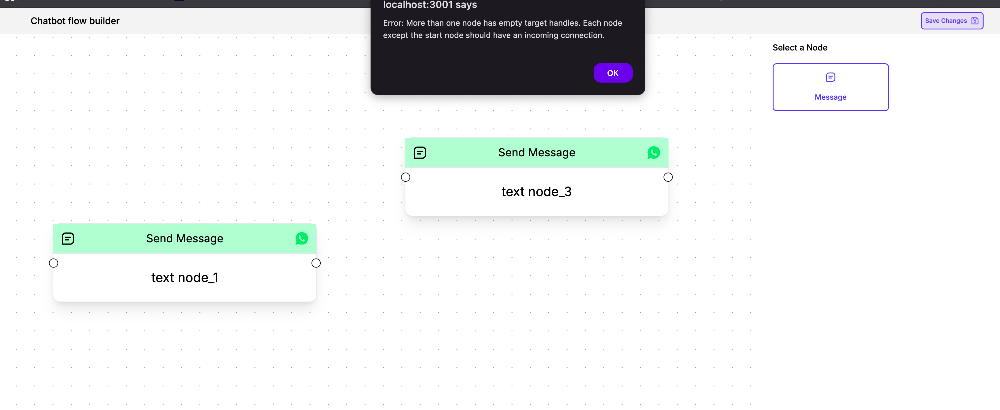

# Chatbot Flow Builder

This project is a powerful and intuitive chatbot flow builder built with React and Next.js. It provides a drag-and-drop interface to design complex chatbot flows with ease.




## Features

- **Drag-and-Drop Interface:** Easily create and connect message nodes.
- **Custom Nodes:** Supports custom node types for different message formats.
- **Extensible Architecture:** Designed for easy addition of new features and node types.
- **Save and Restore:** Save your flow configuration and restore it later.
- **Responsive Design:** Works seamlessly on different screen sizes.

## Tech Stack

- **Framework:** [Next.js](https://nextjs.org/)
- **Styling:** [Tailwind CSS](https://tailwindcss.com/)
- **UI Library:** [React Flow](https://reactflow.dev/)

## Project Structure

```
src
├── app
│   ├── favicon.ico
│   ├── globals.css
│   ├── layout.js
│   └── page.js
└── components
    ├── FlowBuilder.js
    ├── Header.js
    ├── NodePanelSidebar.js
    ├── NodeSelector.js
    ├── edges
    │   └── CustomEdge.js
    ├── editors
    │   └── TextNodeEditor.js
    ├── handles
    │   └── CustomHandle.js
    └── nodes
        └── TextMessageNode.js
```

## Getting Started

### Prerequisites

- [Node.js](https://nodejs.org/en/) (v18.x or later)
- [Yarn](https://yarnpkg.com/)

### Installation

1.  Clone the repository:

    ```bash
    git clone https://github.com/ighmaZ/chatbot-flow-builder.git
    cd chatbot-flow-builder
    ```

2.  Install dependencies:

    ```bash
    yarn install
    ```

3.  Run the development server:

    ```bash
    yarn dev
    ```

4.  Open [http://localhost:3000](http://localhost:3000) in your browser to see the application.

## Usage

- **Add Nodes:** Drag message nodes from the sidebar onto the canvas.
- **Edit Nodes:** Click on a node to edit its content in the sidebar.
- **Connect Nodes:** Drag the handle from one node to another to create an edge.
- **Save Flow:** Click the "Save" button to save the current flow.
